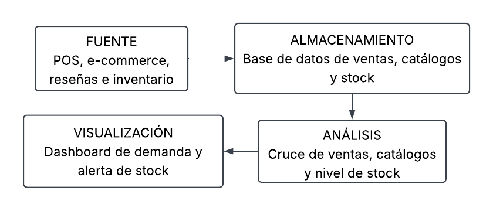

# Ciencia de Datos
## Parcial Práctico · Corte 1

## Actividad

1. Identifique 4 tipos de datos y clasifíquelos como estructurados, semiestructurados o no estructurados.
2. Escriba una pregunta de analítica descriptiva y una de analítica predictiva.
3. Realice un diagrama sencillo: fuente → almacenamiento → análisis → visualización.
4. Escriba 2 frases en inglés explicando la diferencia entre descriptive analytics y predictive analytics.

## Solución

**Planteamiento del caso:** Una tienda especializada en la venta de productos tecnológicos (celulares, computadores, televisores, accesorios y periféricos) que opera tanto en un local físico como a través de una plataforma online, quiere optimizar la gestión de su inventario durante los eventos de descuentos en el mes de noviembre (Black Friday y Cyber Monday).

### Tipos de datos

| Dato | Tipo de dato |
|---|---|
| Historial de ventas de productos (local físico y online) | Estructurado |
| Catálogo de productos (nombre, categoría, precio y especificaciones) | Semiestructurado |
| Reseñas y comentarios de clientes sobre los productos | No estructurado |
| Nivel de inventario disponible por producto en tiempo real | Estructurado |

### Preguntas

**Analítica descriptiva:** ¿Cuáles fueron los productos tecnológicos más vendidos, tanto en tienda física como en la plataforma online, durante los eventos de descuentos de noviembre del año anterior?

**Analítica predictiva:** ¿Qué productos tecnológicos tendrán mayor demanda durante el próximo Black Friday y Cyber Monday, y el nivel de stock actual será suficiente para cubrirla?

### Diagrama

### Frases en inglés

Descriptive analytics is used to analyze historical data after events have already occurred. For example, in this case, it helps identify which technology product categories sold the most during last year's Black Friday and Cyber Monday events.

On the other hand, predictive analytics allows us to use historical and current data to forecast future outcomes. For example, it helps anticipate which products will be in high demand for the next sales event and whether current stock levels will be enough to meet it.
